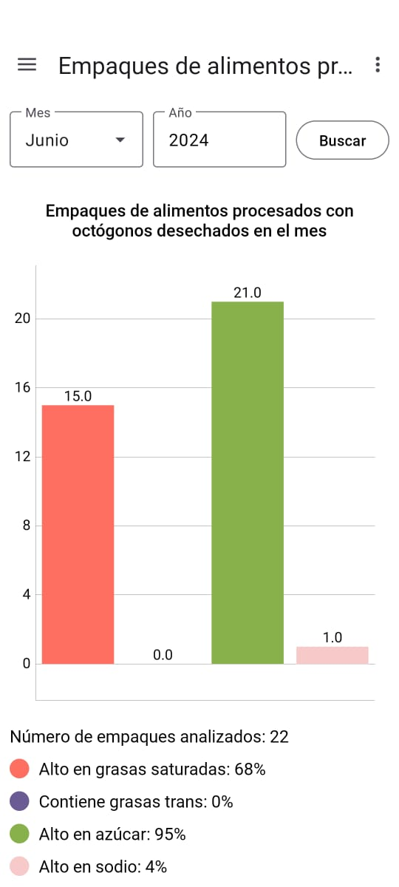
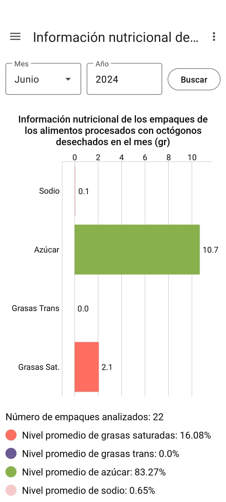
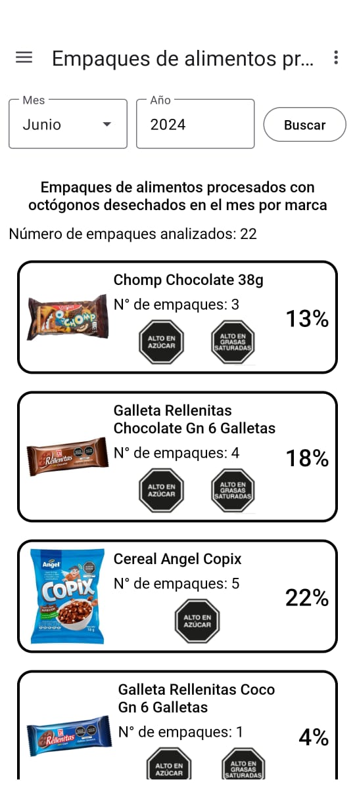
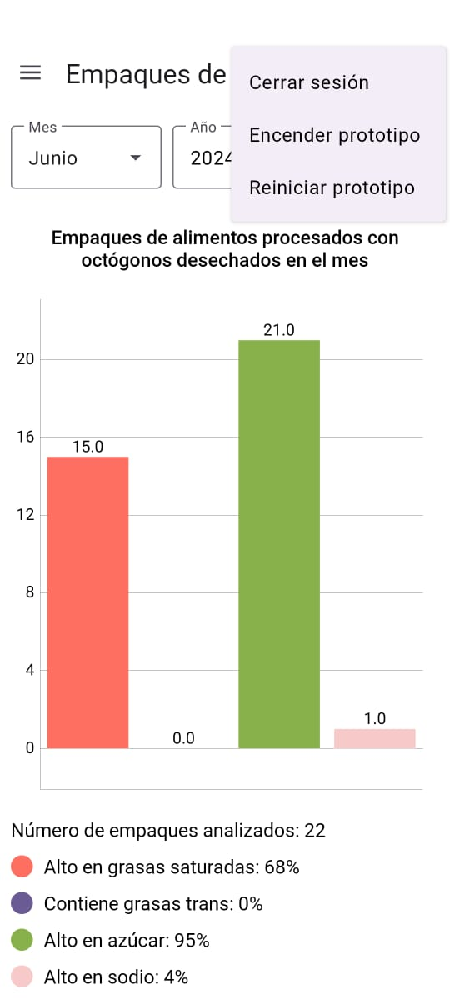
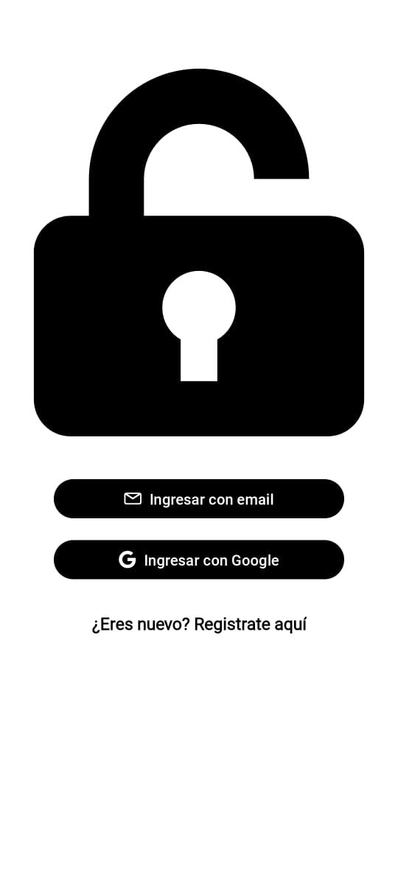
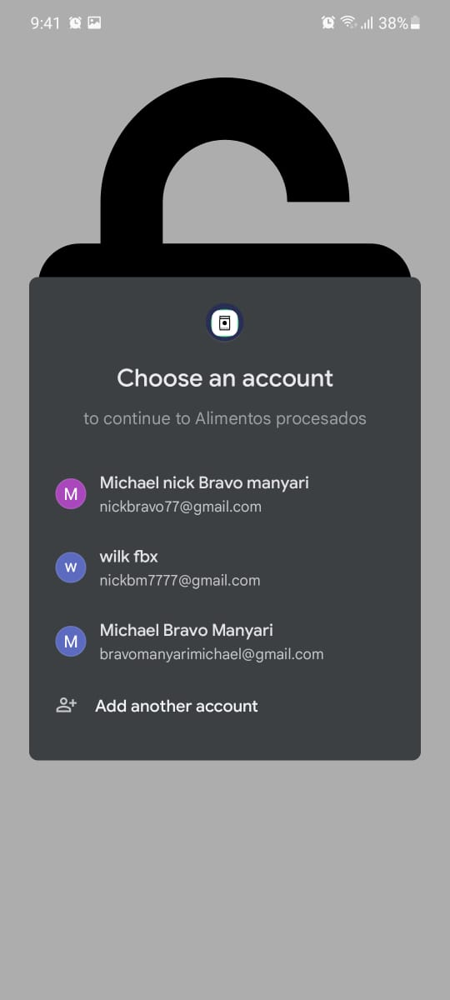
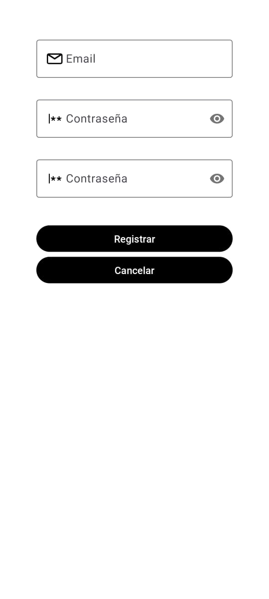

# Processed Foods

## About the App

**Processed Foods** is an Android application designed to monitor and control a smart trash can specifically for processed food packaging. The app provides detailed reports on discarded processed food packages with octagons and allows users to control the smart trash can (turn it on, off, and reset it). Additionally, the app supports user registration and login, leveraging various Firebase services.

## Features

- **Reports of Discarded Packages**: View reports of processed food packaging with octagons discarded in the month.
- **Nutritional Information Reports**: Get detailed nutritional information (sugar, trans fats, saturated fats, sodium in grams) of the discarded processed food packaging with octagons.
- **Brand-Specific Reports**: View reports of discarded processed food packaging with octagons sorted by brand.
- **Smart Trash Can Control**: Turn the smart trash can on or off and reset it.
- **User Authentication**: Login with email or Google account.
- **User Registration**: Register new users via email.

### Screenshots

*Monthly Report of Discarded Packages with Octagons*

*Report of Nutritional Information of Discarded Packages*

*Brand-Specific Report of Discarded Packages*

*Options to Control the Smart Trash Can*

*Login Options Screen*

*Login with Email*

*Login with Google*

*Register with Email*

## Architecture

The app follows the official [Android architecture guidelines](https://developer.android.com/topic/architecture), utilizing the following components:
- **ViewModel**: Manages UI-related data in a lifecycle-conscious way.
- **LiveData**: Provides observable data holder classes.
- **Kotlin Flows**: For asynchronous data streams, ensuring efficient and reactive handling of data updates.
- **Repository Pattern**: Manages data operations and provides a clean API to the ViewModel.
- **Firebase Services**: Authentication, Firestore Database, and Storage.

## UI

The user interface of Processed Foods is built using Material 3 components and custom views, ensuring a modern, responsive, and user-friendly design. Key UI elements include:
- **Material 3 Components**: For a cohesive and responsive design.
- **Custom Views**: Tailored to the specific needs of the app for a unique user experience.
